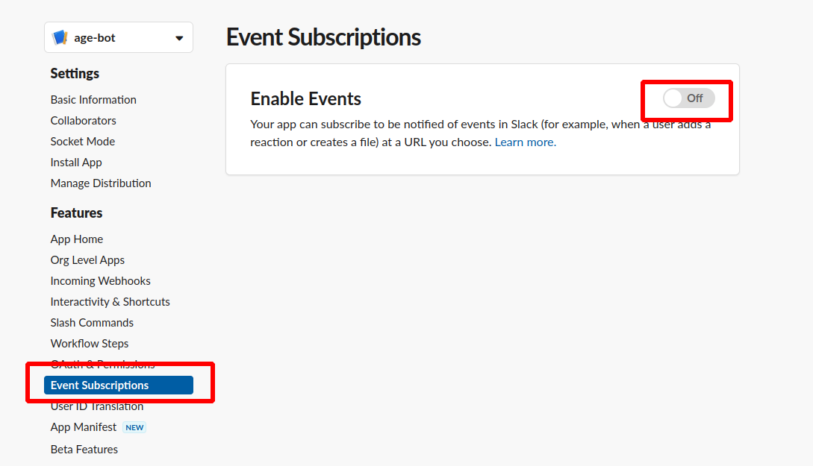
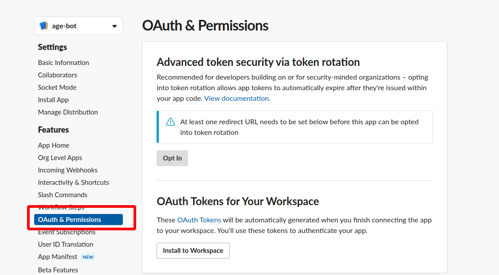

# Go-Slack-Bot-File-Uploader

### Preparation

1. Create an account in Slack
2. Go to https://api.slack.com/apps?new_app=1 and create slack app   
3. Enable sockets   
4. Get Slack application token and use it in SLACK_APP_TOKEN
5. Enable event subscriptions 
6. Configure Slack Event Subscriptions 
7. Configure Slack OAuth and Permissions with adding scopes   
8. Get Slack Bot User OAuth Token and set SLACK_BOT_TOKEN in config file 
10. Add file-bot to the channel in Slack  

### Run

```
go run main.go
```

Go to Slack channel where age-bot was added and ask question with next structure
```
@age-bot My year of birth is {{YOUR_YEAR}}
```
